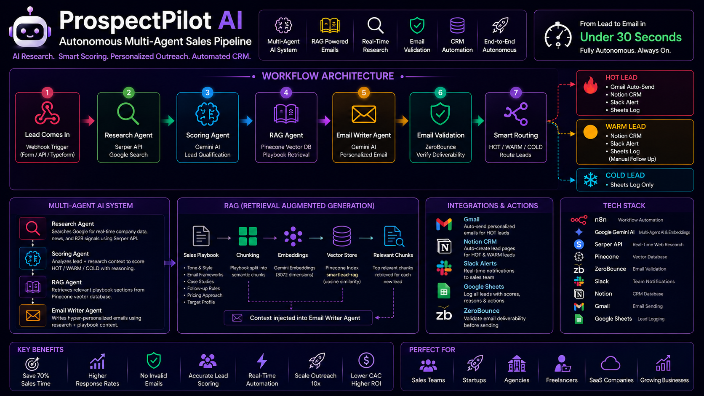
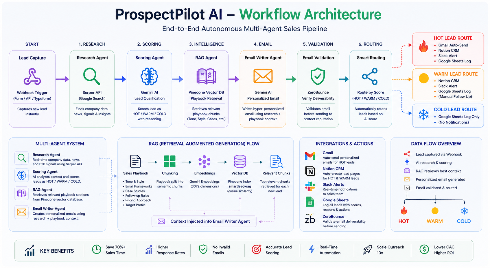
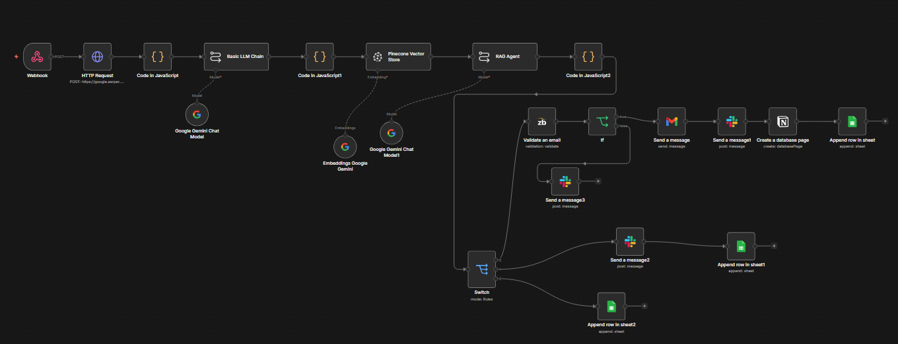
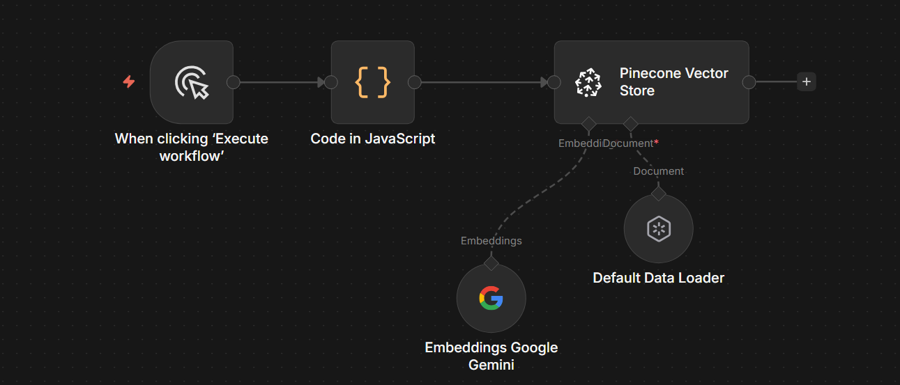
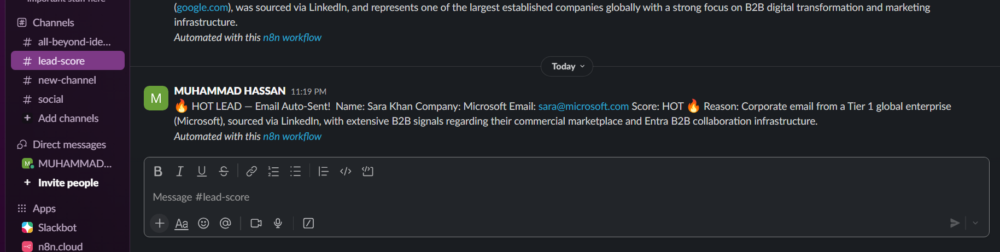
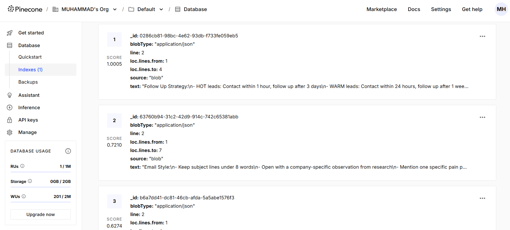
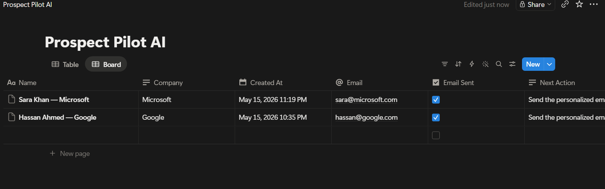
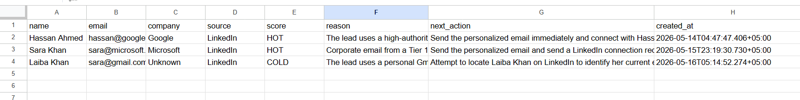
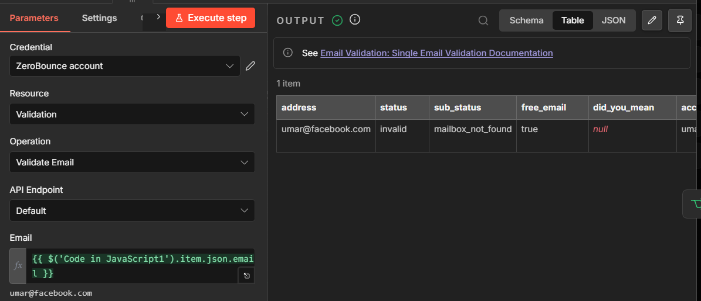

# ProspectPilot AI — Autonomous Multi-Agent Sales Pipeline



## 🚀 Overview

ProspectPilot AI is a fully autonomous AI-powered B2B sales pipeline built with n8n.

The system researches companies in real time, scores leads using AI + company context, retrieves personalized sales knowledge using RAG (Retrieval-Augmented Generation), writes hyper-personalized outreach emails, validates email deliverability, routes leads intelligently, and updates CRM systems automatically.

Built using:

* n8n
* Google Gemini AI
* Pinecone Vector Database
* Serper API
* ZeroBounce
* Slack
* Notion
* Gmail
* Google Sheets

---

# ⚡ What This System Does

When a new lead submits information:

```txt
Lead Comes In
      ↓
Research Agent (Serper API)
      ↓
AI Scoring Agent (Gemini)
      ↓
RAG Agent (Pinecone)
      ↓
AI Email Writer
      ↓
ZeroBounce Validation
      ↓
HOT / WARM / COLD Routing
```

### HOT Leads

* Gmail auto-send
* Slack urgent alert
* Notion CRM creation
* Google Sheets logging

### WARM Leads

* Slack notification
* Notion CRM
* Google Sheets logging

### COLD Leads

* Google Sheets logging only

---

# 🧠 Multi-Agent Architecture



ProspectPilot uses a true multi-agent system where each AI agent specializes in one task.

## Agent 1 — Research Agent 🔍

Uses Serper API to search Google for:

* Company information
* B2B signals
* Industry context
* Recent company news
* LinkedIn/company presence

### Purpose

Provides real-world context before lead scoring.

---

## Agent 2 — Scoring Agent 🧠

Uses Google Gemini AI to:

* Analyze lead intent
* Score HOT / WARM / COLD
* Generate reasoning
* Recommend next actions

### Example Output

```json
{
  "score": "HOT",
  "reason": "Corporate email with strong B2B indicators",
  "next_action": "Send personalized email immediately"
}
```

---

## Agent 3 — RAG Agent 📚

Uses Pinecone Vector Database + Gemini Embeddings.

The agent retrieves:

* Sales playbooks
* Tone guidelines
* Email frameworks
* Case studies
* Follow-up strategies

### Why RAG?

Instead of generic AI responses, the system writes emails using your own sales knowledge and communication style.

---

## Agent 4 — Email Writer Agent ✍️

Combines:

* Lead data
* Company research
* RAG context
* AI reasoning

To generate hyper-personalized outreach emails.

---

# 📚 RAG Pipeline (Retrieval-Augmented Generation)


## How It Works

### Step 1 — Sales Playbook Upload

Your sales playbook is split into semantic chunks.

### Step 2 — Embeddings Generation

Google Gemini Embeddings converts text into 3072-dimension vectors.

### Step 3 — Pinecone Storage

Vectors are stored in Pinecone.

### Step 4 — Semantic Retrieval

When a lead arrives, the system retrieves the most relevant playbook sections.

### Step 5 — Context Injection

Relevant chunks are injected into the AI email writer.

---

# 🔥 End-to-End Workflow


## Full Workflow

```txt
Webhook Trigger
      ↓
Serper API Research
      ↓
Gemini Lead Scoring
      ↓
JSON Parsing
      ↓
Pinecone Retrieval
      ↓
AI Email Generation
      ↓
ZeroBounce Validation
      ↓
Switch Routing
      ↓
HOT / WARM / COLD Actions
```

---

# 🛠️ Tech Stack

| Tool          | Purpose                   |
| ------------- | ------------------------- |
| n8n           | Workflow Automation       |
| Google Gemini | AI Reasoning + Embeddings |
| Pinecone      | Vector Database           |
| Serper API    | Google Search Research    |
| ZeroBounce    | Email Validation          |
| Slack         | Team Notifications        |
| Gmail         | Email Sending             |
| Google Sheets | Lead Logging              |
| Notion        | CRM Database              |

---

# 📸 Project Screenshots

## Main Workflow



---

## RAG Ingestion Workflow



---

## Slack Alerts



---

## Pinecone Vector Database



---

## Notion CRM



---

## Google Sheets Logging



---

## ZeroBounce Validation



---

# ⚙️ Setup Instructions

## 1. Clone Repository

```bash
git clone https://github.com/yourusername/prospectpilot-ai.git
```

---

## 2. Import Workflows into n8n

Import:

* `prospectpilot-main.json`
* `prospectpilot-rag-ingestion.json`

---

## 3. Configure Credentials

Add:

* Google Gemini API
* Pinecone API
* Serper API
* Slack OAuth
* Gmail OAuth
* Google Sheets OAuth
* Notion OAuth
* ZeroBounce API

---

## 4. Configure Pinecone

### Pinecone Settings

```txt
Index Name: smartlead-rag
Dimensions: 3072
Metric: cosine
Cloud: AWS
Region: us-east-1
```

---

## 5. Upload Sales Playbook

Run the RAG ingestion workflow.

This stores your sales knowledge inside Pinecone.

---

## 6. Activate Workflow

Turn on the workflow in n8n.

The system is now fully autonomous.

---

# 📡 API Example

## Request

```json
{
  "name": "Sara Khan",
  "email": "sara@microsoft.com",
  "company": "Microsoft",
  "source": "LinkedIn"
}
```

---

## AI Response

```json
{
  "score": "HOT",
  "reason": "Corporate email with strong B2B indicators",
  "email_draft": "Hi Sara...",
  "next_action": "Send personalized email immediately"
}
```

---

# 📊 AI Scoring Logic

| Score   | Criteria                             | Action           |
| ------- | ------------------------------------ | ---------------- |
| 🔥 HOT  | Corporate email + strong B2B signals | Auto-send email  |
| 🟡 WARM | Real company but weaker intent       | Manual follow-up |
| ❄️ COLD | Gmail/Yahoo + weak signals           | Log only         |

---

# ✅ Features

* Multi-Agent AI System
* Autonomous Lead Qualification
* Real-Time Company Research
* RAG-Based Personalization
* Hyper-Personalized AI Emails
* Email Deliverability Validation
* Smart HOT/WARM/COLD Routing
* Slack Notifications
* Notion CRM Automation
* Google Sheets Logging
* End-to-End Workflow Automation

---

# 📈 Business Benefits

* Reduces manual sales work
* Improves lead qualification
* Generates personalized outreach automatically
* Prevents invalid email sending
* Improves response rates
* Scales outbound sales workflows
* Centralizes CRM operations

---

# 🎯 Use Cases

### Freelancers

Automate lead qualification and outreach.

### Agencies

Offer AI sales automation as a premium service.

### SaaS Companies

Automate inbound lead handling.

### Sales Teams

Scale outreach operations efficiently.

### Startups

Build enterprise-level AI automation systems.

---

# 📁 Repository Structure

```txt
prospectpilot-ai/
│
├── prospectpilot-main.json
├── prospectpilot-rag-ingestion.json
├── sales-playbook.txt
├── README.md
│
└── screenshots/
    ├── prospectpilot-banner.png
    ├── workflow-architecture.png
    ├── end-to-end-pipeline.png
    ├── main-workflow.png
    ├── rag-ingestion.png
    ├── slack-alerts.png
    ├── notion-crm.png
    ├── pinecone-dashboard.png
    ├── google-sheets-log.png
    └── zerobounce-output.png
```

---

# 🆓 Free Tier Usage

| Tool          | Free Tier             |
| ------------- | --------------------- |
| n8n           | 2500 executions/month |
| Google Gemini | Free API tier         |
| Pinecone      | 2GB free forever      |
| Serper API    | 2500 searches/month   |
| ZeroBounce    | 100 validations/month |
| Notion        | Free                  |
| Slack         | Free                  |
| Gmail         | Free                  |
| Google Sheets | Free                  |

---

# 👨‍💻 Author

Muhammad Hassan

AI Automation Engineer | n8n Expert | RAG Systems Builder

---

# 📄 License

MIT License

Free to use, modify, and distribute.
